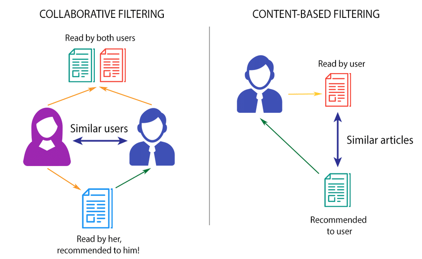
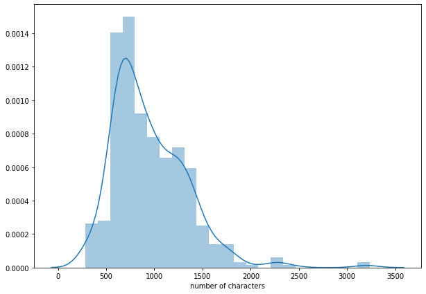
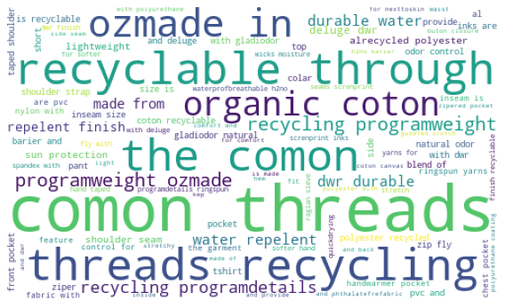

# E-commerce-Product-Recommendations---Recommendation-System

## Context

This dataset taken from [Kaggle](https://www.kaggle.com/cclark/product-item-data). 
# E-Commerce Product --- Recommender System

Rekomendasi produk ini dibuat berdasarkan <b>content-based filtering</b> menggunakan <b>Cosine Similarity dan Jaccard Similarity.</b>  Kemudian saya akan coba bandingkan keduanya secara kualitatif. Ilustrasi content-based filtering dapat dilihat di bawah.


```python
from IPython.display import Image
Image(filename='1.png') 
```





Source: https://www.themarketingtechnologist.co/building-a-recommendation-engine-for-geeksetting-up-the-prerequisites-13/


```python
import pandas as pd
import numpy as np
import matplotlib.pyplot as plt
import seaborn as sns

from nltk.tokenize import word_tokenize
from sklearn.feature_extraction.text import CountVectorizer
from sklearn.metrics.pairwise import cosine_distances
from sklearn.metrics import jaccard_similarity_score
import string
from nltk.corpus import stopwords
import nltk
from wordcloud import WordCloud
import re
from sklearn.decomposition import TruncatedSVD

import warnings
warnings.filterwarnings("ignore") 
```


```python
df = pd.read_csv('sample-data.csv')
df.shape
```


    (500, 2)


```python
df.head()
```


<div>
<style scoped>
    .dataframe tbody tr th:only-of-type {
        vertical-align: middle;
    }

    .dataframe tbody tr th {
        vertical-align: top;
    }

    .dataframe thead th {
        text-align: right;
    }
</style>
<table border="1" class="dataframe">
  <thead>
    <tr style="text-align: right;">
      <th></th>
      <th>id</th>
      <th>description</th>
    </tr>
  </thead>
  <tbody>
    <tr>
      <th>0</th>
      <td>1</td>
      <td>Active classic boxers - There's a reason why o...</td>
    </tr>
    <tr>
      <th>1</th>
      <td>2</td>
      <td>Active sport boxer briefs - Skinning up Glory ...</td>
    </tr>
    <tr>
      <th>2</th>
      <td>3</td>
      <td>Active sport briefs - These superbreathable no...</td>
    </tr>
    <tr>
      <th>3</th>
      <td>4</td>
      <td>Alpine guide pants - Skin in, climb ice, switc...</td>
    </tr>
    <tr>
      <th>4</th>
      <td>5</td>
      <td>Alpine wind jkt - On high ridges, steep ice an...</td>
    </tr>
  </tbody>
</table>
</div>


```python
df.drop('id', inplace = True, axis = 1)
```


```python
df.head()
```


<div>
<style scoped>
    .dataframe tbody tr th:only-of-type {
        vertical-align: middle;
    }

    .dataframe tbody tr th {
        vertical-align: top;
    }

    .dataframe thead th {
        text-align: right;
    }
</style>
<table border="1" class="dataframe">
  <thead>
    <tr style="text-align: right;">
      <th></th>
      <th>description</th>
    </tr>
  </thead>
  <tbody>
    <tr>
      <th>0</th>
      <td>Active classic boxers - There's a reason why o...</td>
    </tr>
    <tr>
      <th>1</th>
      <td>Active sport boxer briefs - Skinning up Glory ...</td>
    </tr>
    <tr>
      <th>2</th>
      <td>Active sport briefs - These superbreathable no...</td>
    </tr>
    <tr>
      <th>3</th>
      <td>Alpine guide pants - Skin in, climb ice, switc...</td>
    </tr>
    <tr>
      <th>4</th>
      <td>Alpine wind jkt - On high ridges, steep ice an...</td>
    </tr>
  </tbody>
</table>
</div>


# Preprocessing


```python
from random import randint, seed

seed(101)
df.loc[randint(1, len(df))]['description']
```


    'Active boy shorts - We\'ve worn these versatile, feminine boy shorts as on-the-fly bathing suit bottoms, to Bikram yoga class, as sleepwear - their functionality is limitless. Low-rise Active Boy Shorts are tube-constructed to eliminate chafing side seams, and their soft, technical fabric breathes and wicks moisture to keep you comfortable and dry. We\'ve shortened the flat waistband in front for a fit that won\'t roll or bind; stretchy shaped openings at legs are newly redesigned with less fabric to minimize bunching. Solids and prints: 4.6-oz 93% nylon/7% spandex.<br><br><b>Details:</b><ul> <li>"Ultrasoft, lightweight fabric with stretch and moisture management"</li> <li>Seamless construction</li> <li>"Waistband and shaped leg openings lie flat, won\'t roll or bind for well deserved comfort and mobility"</li></ul><br><br><b>Fabric: </b>"4.6-oz 93% nylon/7% spandex, with moisture-wicking performance"<br><br><b>Weight: </b>(31 g 1.1 oz)<br><br>Made in Israel.'


> Kalau dilihat dari sample random di atas, data ini banyak tag html yang harus dibersihkan.


```python
def clean(txt):
    txt = re.sub('https?:\/\/\S+', '', txt) 
    cl = re.compile('<.*?>')
    txt = re.sub(cl, '', txt)
    txt = re.sub('https?:\/\/\S+', '', txt) 
    txt = re.sub(r'(\w)\1+', r'\1', txt)
    txt = re.sub('[%s]' % re.escape(string.punctuation), '', txt)
    txt = str(txt).lower()
    return txt

def re_stopword(x):
    return [y for y in x if y not in stopwords.words('english')] 

df['description'] = df['description'].apply(clean)
```

# EDA


```python
df['number of characters'] = df['description'].apply(lambda x : len(x))

plt.figure(figsize = (10, 7))
sns.distplot(df['number of characters'])
```


    <matplotlib.axes._subplots.AxesSubplot at 0x7f74b7ca9d90>





Jumlah karakter tidak terlalu banyak, mengingat fitur ini hanya berupa deskripsi produk. 

## WordsCloud


```python
allWords = ''.join(i for i in df['description'])
wordsCloud = WordCloud(max_font_size=100, max_words=100, width=500, height=300, background_color = 'white').generate(allWords)

plt.figure(figsize=(8,8))
plt.imshow(wordsCloud)
plt.axis("off")
plt.tight_layout()
plt.show()
```





Produk-produk di dataset ini kebanyakan produk untuk pakaian luar. Itu kenapa, kata-kata yang bermunculan kebanyakan adalah kata-kata yang berhubungan dengan bahan-bahan baju dan ramah lingkungan. 

## Bag Of Words


```python
bow = CountVectorizer(stop_words = 'english', tokenizer = word_tokenize) #BagOfWords
bank = bow.fit_transform(df['description'])
```

# Recommendation System

## Cosine Similarity

Cosine similarity punya persamaannya yang sederhana, yaitu:

$$similarity = \cos(\theta) = \frac{\vec{A}\cdot \vec{B}}{\left | A \right |\left | B \right |} $$

Melihat persamaan di atas, seharusnya kita langsung mendapatkan idenya. Karena semakin kecil sudutnya (bisa dibayangkan kedekatan dua objek) semakin besar nilainya. Nilai cos hanya berada di antara -1 dan 1.


```python
content = [df.loc[218]['description']]
code = bow.transform(content)

cos = cosine_distances(code, bank)
idx = pd.Series(cos[0]).sort_values()[1:11].index
```


```python
df.iloc[idx]
```


<div>
<style scoped>
    .dataframe tbody tr th:only-of-type {
        vertical-align: middle;
    }

    .dataframe tbody tr th {
        vertical-align: top;
    }

    .dataframe thead th {
        text-align: right;
    }
</style>
<table border="1" class="dataframe">
  <thead>
    <tr style="text-align: right;">
      <th></th>
      <th>description</th>
      <th>number of characters</th>
    </tr>
  </thead>
  <tbody>
    <tr>
      <th>290</th>
      <td>print adour btm  adours have a slightly scoped...</td>
      <td>291</td>
    </tr>
    <tr>
      <th>239</th>
      <td>print bayone btm  the lowrise bayone botoms ha...</td>
      <td>325</td>
    </tr>
    <tr>
      <th>260</th>
      <td>print paries btm  styled like a boy short our ...</td>
      <td>426</td>
    </tr>
    <tr>
      <th>254</th>
      <td>solid suname btm  stayput sunames fit straight...</td>
      <td>294</td>
    </tr>
    <tr>
      <th>253</th>
      <td>solid paries btm  the boyshortstyle paries bot...</td>
      <td>413</td>
    </tr>
    <tr>
      <th>261</th>
      <td>print suname btm  stayput sunames fit straight...</td>
      <td>294</td>
    </tr>
    <tr>
      <th>219</th>
      <td>solid betina btm  our fulest coverage botoms t...</td>
      <td>338</td>
    </tr>
    <tr>
      <th>7</th>
      <td>print banded betina btm  our fulest coverage b...</td>
      <td>333</td>
    </tr>
    <tr>
      <th>220</th>
      <td>solid bibiana 1 piece  the sporty bibiana onep...</td>
      <td>380</td>
    </tr>
    <tr>
      <th>240</th>
      <td>print bibiana tankini  the bibiana tankinis ra...</td>
      <td>373</td>
    </tr>
  </tbody>
</table>
</div>


## Jaccard Similarity

Jaccard juga sama dengan cosine similarity, dia juga punya persamaan yang sederhana: 

$$J(A,B) = \frac{\left | A\cap B \right |}{\left | A\cup B \right |}$$

Seharusnya dari persamaan di atas, kita langsung mendapatkan idenya. Semakin besar irisannya, artinya semakin banyak juga kesamaannya. Jaccard indeks hanya berada di antara 0 dan 1.


```python
J = []

for i in range(len(bank.toarray())):
    J.append(jaccard_similarity_score(code.toarray()[0], bank.toarray()[i]))
 
ind = pd.Series(J).sort_values(ascending = False)[1:11].index
```


```python
df.iloc[ind]
```


<div>
<style scoped>
    .dataframe tbody tr th:only-of-type {
        vertical-align: middle;
    }

    .dataframe tbody tr th {
        vertical-align: top;
    }

    .dataframe thead th {
        text-align: right;
    }
</style>
<table border="1" class="dataframe">
  <thead>
    <tr style="text-align: right;">
      <th></th>
      <th>description</th>
      <th>number of characters</th>
    </tr>
  </thead>
  <tbody>
    <tr>
      <th>290</th>
      <td>print adour btm  adours have a slightly scoped...</td>
      <td>291</td>
    </tr>
    <tr>
      <th>254</th>
      <td>solid suname btm  stayput sunames fit straight...</td>
      <td>294</td>
    </tr>
    <tr>
      <th>239</th>
      <td>print bayone btm  the lowrise bayone botoms ha...</td>
      <td>325</td>
    </tr>
    <tr>
      <th>261</th>
      <td>print suname btm  stayput sunames fit straight...</td>
      <td>294</td>
    </tr>
    <tr>
      <th>219</th>
      <td>solid betina btm  our fulest coverage botoms t...</td>
      <td>338</td>
    </tr>
    <tr>
      <th>7</th>
      <td>print banded betina btm  our fulest coverage b...</td>
      <td>333</td>
    </tr>
    <tr>
      <th>253</th>
      <td>solid paries btm  the boyshortstyle paries bot...</td>
      <td>413</td>
    </tr>
    <tr>
      <th>260</th>
      <td>print paries btm  styled like a boy short our ...</td>
      <td>426</td>
    </tr>
    <tr>
      <th>220</th>
      <td>solid bibiana 1 piece  the sporty bibiana onep...</td>
      <td>380</td>
    </tr>
    <tr>
      <th>221</th>
      <td>solid bibiana top  the athletic bibiana tops r...</td>
      <td>474</td>
    </tr>
  </tbody>
</table>
</div>


Menarik, melihat adanya irisan terhadap rekomendasi yang menggunakan Jaccard dan Cosine Similarity.

# Sanity Check


```python
df.loc[218]['description']
```


    'solid adour btm  adours feature a scoped lowrise front lined and medium coverage in back our improved fabric blend is made of 82 nylon18 spandexdetails medium coverage lined front slightly scoping front low rise improved fabricfabric 56oz 82 nylon18 spandexweight 43 g 15 ozmade in usa'


## Cosine Similarity


```python
df.loc[290]['description']
```


    'print adour btm  adours have a slightly scoped lowrise front lined and medium coverage in back our improved fabric blend is made of 82 nylon18 spandexdetails medium coverage lined front slightly scoping front low rise improved fabricfabric 56oz 82 nylon18 spandexweight 43 g 15 ozmade in usa'


```python
df.loc[239]['description']
```


    'print bayone btm  the lowrise bayone botoms have adjustable side ties and minimal seat coverage  les than al of our other styles lined front made from a blend of 82 nylon18 spandexdetails least coverage lined front adjustable sidetie closures low rise improved fabricfabric 56oz 82 nylon18 spandexweight 43 g 15 ozmade in usa'


```python
df.loc[260]['description']
```


    'print paries btm  styled like a boy short our paries botoms fit low and straight acros the hips with medium coverage in front and ful coverage in back lined front made from our improved fabric blend of 82 nylon18 spandexdetails boyshort style lined front fits low and straight acros hips updated waist styling medium coverage in front ful back coverage improved fabricfabric 56oz 82 nylon18 spandexweight 54 g 19 ozmade in usa'


## Jaccard Similarity


```python
df.loc[290]['description']
```


    'print adour btm  adours have a slightly scoped lowrise front lined and medium coverage in back our improved fabric blend is made of 82 nylon18 spandexdetails medium coverage lined front slightly scoping front low rise improved fabricfabric 56oz 82 nylon18 spandexweight 43 g 15 ozmade in usa'


```python
df.loc[254]['description']
```


    'solid suname btm  stayput sunames fit straight acros the hips with ful coverage in back lined front made from a formfiting blend of 82 nylon18 spandexdetails ful coverage lined front fits straight acros hips regular rise improved fabricfabric 56oz 82 nylon18 spandexweight 43 g 15 ozmade in usa'


```python
df.loc[239]['description']
```


    'print bayone btm  the lowrise bayone botoms have adjustable side ties and minimal seat coverage  les than al of our other styles lined front made from a blend of 82 nylon18 spandexdetails least coverage lined front adjustable sidetie closures low rise improved fabricfabric 56oz 82 nylon18 spandexweight 43 g 15 ozmade in usa'


Pada sistem rekomendasi memang tidak ada sistem yang lebih baik atau lebih buruk. Namun kalau dilihat dari hasil antara dua pendekatan di atas, mereka memiliki hasil yang bersinggungan dan rekomendasi-rekomendasi yang diberikan mirip dengan produk yang dipilih sebelumnya. 


```python

```

## Conclusion

In the recommendation system there is no better or worse system. But when we look from the results, I can say, they have a good results and the recommendations given are similar to the product chosen. For detail, can be seen in [this notebook](https://github.com/Stev-create/E-commerce-Product-Recommendations---Recommendation-System/blob/master/E-Commerce%20Product%20Recommendation.ipynb).


